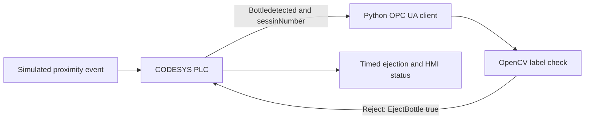

# Bottle Label Inspection with CODESYS, OPC UA, Python and OpenCV

> A laboratory prototype that links a CODESYS PLC emulator to a Python/OpenCV image check through OPC UA, then displays an accept or reject state in a simple HMI.

## Overview

This project demonstrates a basic machine-vision workflow for bottle-label inspection. CODESYS generates a simulated bottle-detection event. A Python client reads the PLC state through OPC UA, selects a local bottle image, and checks for a label using grayscale conversion, adaptive thresholding, contour extraction and polygon approximation. When the image is classified for rejection, Python writes `EjectBottle` to the PLC. CODESYS handles the timed ejection state and updates the HMI indicators.

The demonstration runs with an emulated PLC and local image files. It does not use a live camera, conveyor, physical sensor or ejector.

## What the project demonstrates

- CODESYS Control Win V3 x64 PLC emulation and Ladder logic.
- OPC UA communication between PLC variables and a Python client.
- OpenCV image processing with adaptive thresholding and contour geometry.
- A simulated detection, accept/reject and timed ejection sequence.
- Basic HMI indication for accepted and rejected bottles.

## Signal flow



## Processing method

1. Python waits for `Bottledetected` and a new `sessinNumber`.
2. It selects one of two local JPEG files and loads it in grayscale.
3. OpenCV applies adaptive mean thresholding with a block size of 11 and `C = 5`.
4. `findContours` extracts candidate shapes. `approxPolyDP` approximates each contour using an epsilon equal to 2% of its perimeter.
5. A candidate is treated as a label when its area is between 142 and 31,320 pixels and its approximation has four vertices.
6. If no candidate meets the label criterion, Python writes `EjectBottle = true`; the PLC controls the timed output and HMI state.

## Requirements

- Windows with CODESYS Control Win V3 x64 installed.
- Python 3.11 or a compatible Python 3 environment.
- A CODESYS application with its OPC UA server enabled and the required PLC variables exposed.
- Two local test images: one bottle image with a label and one without.
- Optional: UaExpert to inspect the OPC UA address space and verify tag values.

Install the Python packages:

```bash
python -m pip install opencv-python opcua
```

## Repository files

```text
.
├── plc_connecting_code.py
├── images/
│   ├── bottle_label.jpg
│   └── bottle.jpg
└── README.md
```

The image directory above is a suggested layout. Add the two test images to your repository, then update the paths in `chooseImage()` in `plc_connecting_code.py` to match their locations. The current script contains local Windows file paths.

## CODESYS and OPC UA setup

1. Start the CODESYS Control Win V3 x64 runtime and log in to the PLC application.
2. Enable the OPC UA server in the application and expose the variables used by the Python client.
3. Confirm that the PLC variables are available under the program path expected by `plcVarPath` in `plc_connecting_code.py`.
4. Check the endpoint and port in the CODESYS configuration. The script defaults to `opc.tcp://DESKTOP-QUBUSE2:4840`; this hostname is specific to the development computer.
5. If needed, set another endpoint before launching Python:

   **PowerShell**

   ```powershell
   $env:OPCUA_ENDPOINT = "opc.tcp://localhost:4840"
   ```

   **Command Prompt**

   ```bat
   set OPCUA_ENDPOINT=opc.tcp://localhost:4840
   ```

6. Use UaExpert to confirm that the server is reachable and that tags such as `Bottledetected`, `EjectBottle`, `exit_script` and `sessinNumber` are visible.

The CODESYS device path, namespace indices, PLC variable spelling and endpoint may differ on another computer. Update `plcVarPath` and the PLC variable names in the Python script if the project configuration differs.

## Run the Python client

With the PLC runtime running and the image paths configured, start the script from the repository directory:

```bash
python plc_connecting_code.py
```

The client prints connection and classification messages in the terminal. Set the PLC's `exit_script` variable to stop the main loop.

## PLC variables used

- `Bottledetected`: PLC-to-Python bottle event.
- `sessinNumber`: PLC-to-Python session value. This spelling is retained from the current CODESYS application.
- `EjectBottle`: Python-to-PLC rejection command; the PLC logic resets it after the configured timer.
- `exit_script`: PLC-to-Python stop flag.
- `accepted` and `unaccepted`: PLC status flags used by the HMI.

## Current limitations

- Image acquisition is simulated by randomly selecting a file; a camera is not connected.
- The contour thresholds are tuned to the example images. Classification accuracy has not been measured on a representative image set.
- In the current `check_label()` implementation, an empty contour list returns `False` for ejection. That case should be changed to reject or raise a diagnostic before relying on the classifier.
- Python advances a local session counter instead of assigning the PLC's `sessinNumber`; resets can cause the two values to drift.
- The current loop has no explicit delay or automatic OPC UA reconnection handling.
- The CODESYS runtime logs captured during development included scheduler-tick failures, so continuous runtime stability has not been established.

## Learning reference

The project follows the practical topics covered in [PLC Basic Machine Vision | From Scratch](https://www.udemy.com/course/plc-basic-machine-vision-from-scratch/), by Mouhammad Hamsho and Kemalaldin Hamso. The code, PLC logic and screenshots in this repository document my implementation and test setup.
